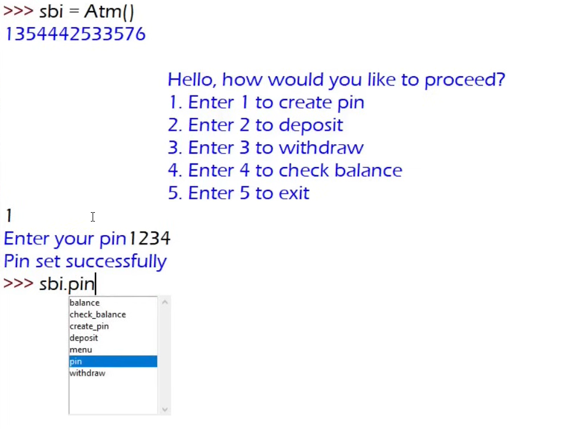
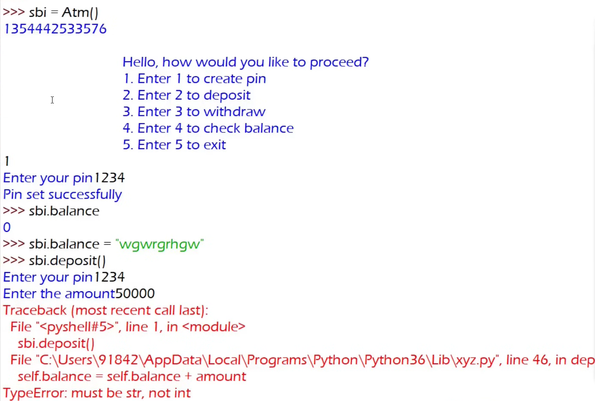
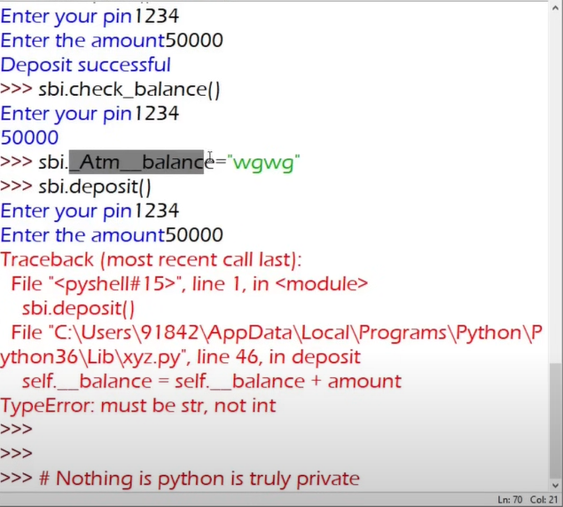
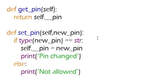
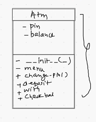

# instance variable

- jesob variables constractor er vitor thake. like:

```python

def __init__(self):
    self.pin = ""
    self.balance = 0

```

- These variables are different for every ojects.

# Encapsulation

- when we create an object from a class, it/object can access every methods and variables.



- As it can access those, it can manipulate these.



- So we have to restrict these to make them private. and this called encapsulation. 

```python

self.__pin = ""
self.__balance = 0

   def create_pin(self):
        self.__pin = input("Set your pin: ")
        print("Pin set successfully.")

    def deposit(self):
        temp = input("Enter your pin: ")
        if temp == self.__pin:
            amount = int(input("Enter amount to deposit: "))
            if amount > 0:
                self.__balance += amount
                print("Deposit successful.")
            else:
                print("Invalid amount.")
        else:
            print("Invalid pin.")
```

- we also use encapsulation for restrict methods.

```python

 self.__menu()

    def __menu(self):
        while True:
            user_input = input("""
        Hello, How would you like to proceed?
        1. Enter 1 to create pin
        2. Enter 2 to deposit
        3. Enter 3 to withdraw
        4. Enter 4 to check balance
        5. Enter 5 to exit
        Your choice: """)

```

- Python is the language made for adults!! 😁🤣
- Not likely two developer from india and pakistan are working on the same codebase. 🤣🤣🤣



 - __pin : Encapsulation is a gentalmen agreement.


 # Getter and Setter

 - get and set are commonly used in class to access those private datas and methods.

 ```python

def get_pin(self):
    return self.__pin

def set_pin(self, new_pin):
    self.__pin = new_pin
    print("Pin Changed!!)

 ```

 ```python

brac = Atm()
brac.get_pin()
brac.set_pin("22543")
brac.get_pin()

 ```

 

 - This whole idea is called Encapsulation!!

# Class Diagram



This is a class diagram for a Python class named Atm. Class diagrams are a part of UML (Unified Modeling Language) used in object-oriented programming to visually represent the structure of a class — including its attributes (data) and methods (functions).

- Here's a breakdown of the diagram:

# Class Name:
Atm

# Attributes (fields):
- pin → Private attribute for storing the PIN.

- balance → Private attribute for storing the account balance.

(Private attributes are denoted with a minus - sign.)

# Methods (functions):
- __init__() → Private constructor used to initialize an object (though typically constructors are public in Python).

- menu → A private method to display or handle a menu (possibly to interact with the ATM).

+ change_pin() → Public method to change the ATM PIN.

+ deposit() → Public method to deposit money.

+ with() → Public method to withdraw money.

+ check_bal() → Public method to check the account balance.

(Public methods are denoted with a plus + sign.)