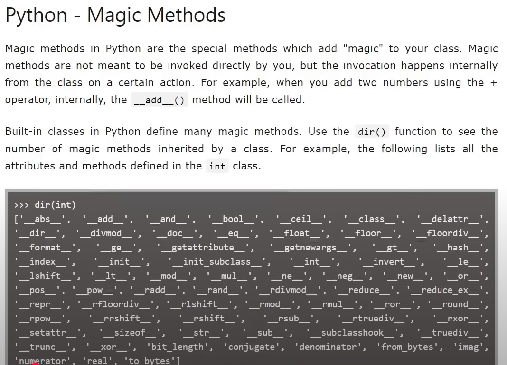
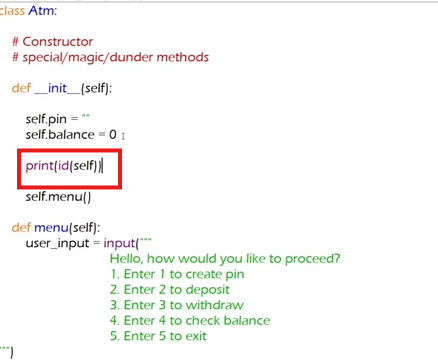
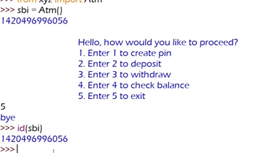

#constructor

- python e kichu methods ke special methods bola hy. eiguloke magic/dunder methods o bola hy.


- __init__ je constractor eta ekta magic method. 

- We can't make a magic methods; it's predefined, but can use it.



- Concept of megic method: ei methods ke object call kore na, they have been called automatically. like __init__ constractor get called when object banano hy.

- So, megic methods apna apni call hy. Constructor is one of the magic methods. and it's called when object is creating.

# what is the advantages?
- object creation er somoy code automatically call hy, etar subidha ki? 
- constractor jehetu user call korte pare na; app open howar sathe sathe __init__ call hy. tay constractor er vitore configuration related task thake, jeta user end er hate thakbe na. like app on howar pore internet/db er sathe connect howa.

===================================================================================================================

If the world is a class,
Human is the object,
Programmer is God,
Then maybe... death is part of the constructor —
already initialized when we are born. 🕊️

We spend our whole lives running functions like learn(), love(), fail(), tryAgain(),
But the death() method… it's silently queued since instantiation.

Make your code (life) meaningful before it returns.
Because unlike code, we don’t get a re-run.

```python
class Human:
    def __init__(self):
        print("Human born")

    def death(self):
        print("Death already scheduled")


class World:
    def __init__(self):
        self.human = Human()  # object created
        # ...some lines of code
        self.human.death()    # already scheduled at birth


# Creating the world
world = World()

```

# self in python

- python e self kichu hole, seta objecti hobe; as everything in python is an object. As it's an object then it should be stored in somewhere. Self has id/address where it stored.





- object tai self!!


- different objects, different self.
- Je object er sathe currently kaj hy; setay self.
- in class methods and attributes amra self diyei access kori; object/self chara eigulo access kora jay na, like: self.pin & self.balance. Like: "def deposit(self):" and "def withdraw(self):".


