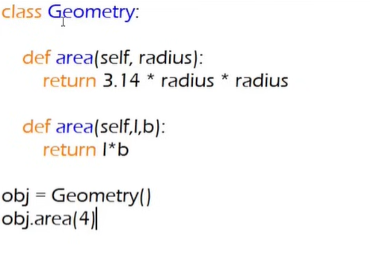
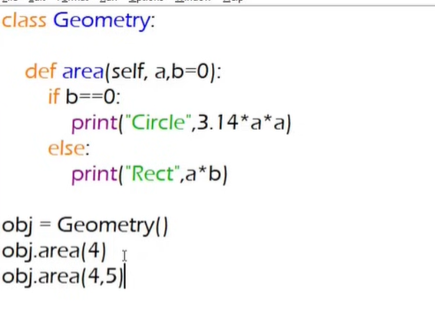

- This is correct for java but not in python. It always looks for b.



- technically python have not method overloading. But we can make it by using default argument value.




- There some operators in programming language. Logical Operators, Relational Operators, arithmetic operators etc. Sob operators er ekta default behaviour ache. Like: + add, duita numbers dile add operators oita methametically addition kore.
- But when we use + operators for doing different behaviours, which called operator overloading; Behave differently in different situations.

```python

"Hello" + "world"  #string concatination

```

```python

2 + 2  #mathematical operation

```

- Another example we made fraction class, where + sign not doing methametical normal behave rether fractional addition.

- this is polymorphsim