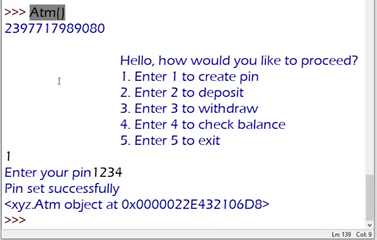

# Reference Variable



- if we create an object and don't store it inside of a variable then it just a memory location. We can't use it, we lost the object.

- So while creating an object, it's important to hold it inside of a variable. Which also called Reference Variable.

```python

brac = Atm()  #brac is the Reference Variable

```

