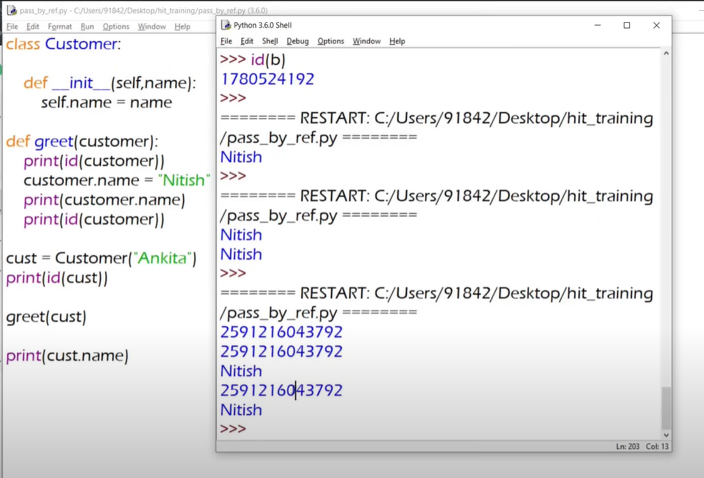
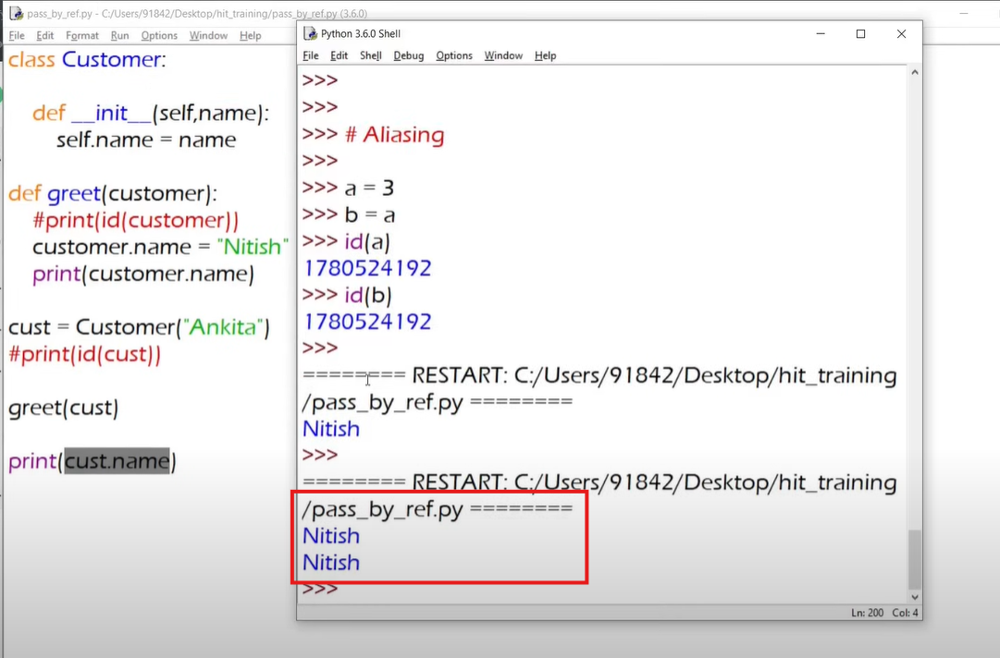
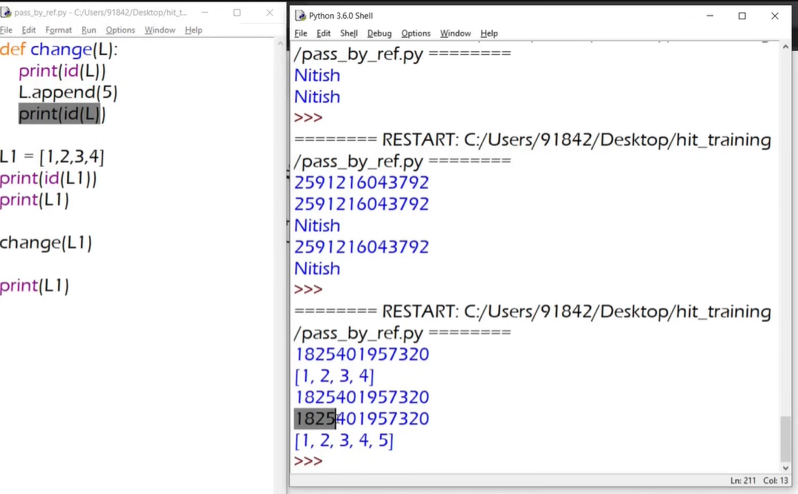
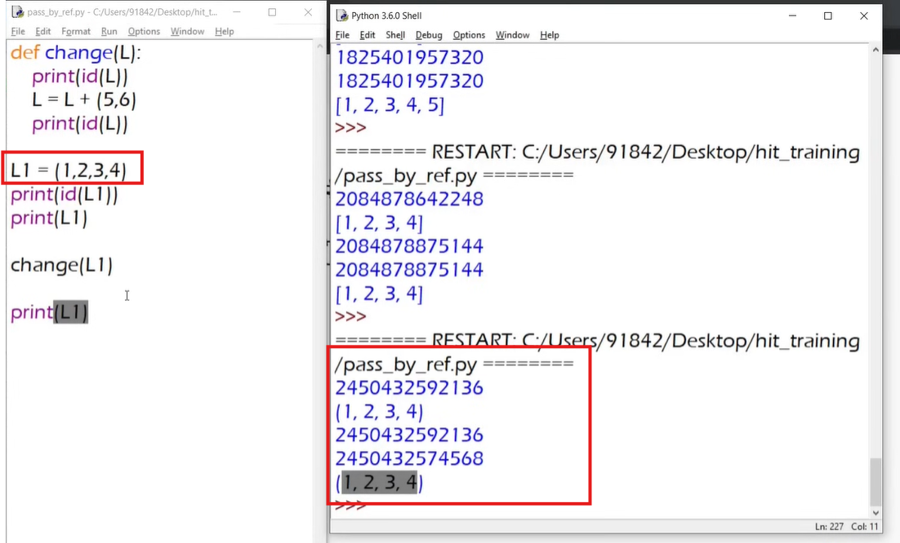

# Reference Variable


- if we create an object and don't store it inside of a variable then it just a memory location. We can't use it, we lost the object.

- So while creating an object, it's important to hold it inside of a variable. Which also called Reference Variable.

```python

brac = Atm()  #brac is the Reference Variable

```

# Pass by Reference




# Understanding Pass by Reference in Python

## 🔍 What is Pass by Reference?
In Python, when you pass an object to a function, you're actually passing a **reference to the object**, not a copy of the object. However, this can sometimes be misunderstood because of how Python handles object references.

## 🧠 Key Concepts
- **Everything in Python is an object.**
- **Variables are references (pointers) to these objects.**
- Function arguments are **passed by assignment**.

> If the object is **mutable** (like a list or a class instance), you can modify it within the function.
> If you **reassign** the parameter to a new object, the original reference remains unchanged.

---

## ✅ Your Code Example
```python
class Customer:
    def __init__(self, name, gender):
        self.name = name
        self.gender = gender

def greet(customer):
    if customer.gender == "Male":
        print("Hello", customer.name, "sir")
    else:
        print("Hello", customer.name, "ma'am")

    cust2 = Customer("Nitish", "Male")
    return cust2

cust = Customer("Ankita", "Female")
new_cust = greet(cust)
print(new_cust.name)
```

### 🧾 Output:
```
Hello Ankita ma'am
Nitish
```

### Explanation:
- `cust` is passed to the function `greet`.
- Inside `greet`, `customer` is a reference to the same object as `cust`.
- But no mutation is done to `customer`.
- A new `Customer` object (`cust2`) is created and returned.
- `new_cust` receives this new object, and the original `cust` remains unchanged.

---

## 🔄 Actual Mutation Example
To really show **pass-by-reference behavior**, mutate the object inside the function:

```python
def greet(customer):
    customer.name = "ChangedName"
    customer.gender = "Other"
    return customer
```

Now, the original `cust` object will be changed:
```
print(cust.name)  # Output: ChangedName
```

---

## 🧠 Conclusion:
- Python passes **object references** to functions.
- If you **mutate** the object, the change is reflected outside the function.
- If you **reassign** the parameter to a new object, it does not affect the original.

This behavior is often referred to as **"pass-by-object-reference"** or **"pass-by-assignment"** in Python.

---

Let me know if you'd like to explore this concept with lists, dictionaries, or more examples!

# Variable Overwriting



# Class ke objects are also mutable like lists, dict and sets







- Pass by reference er maddhome mutable data type pathale orginal e change asbe. r immutable data type pathale orginal e change hobe na.