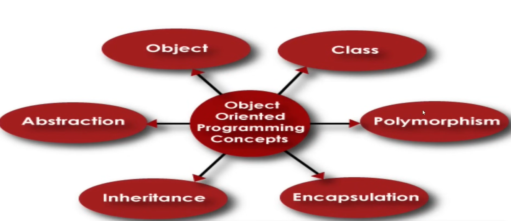

# Object-Oriented Programming (OOP) Concepts in Python



---

## Introduction

- Object-Oriented Programming is a **different style of writing code**.
- The idea is that **everything in Python is an object**.
- This allows for flexible, scalable, and modular code.

---

## Observations

```python
l = [2, 5, 7]
l.upper()  # AttributeError

city = "Dhaka"
city.append("a")  # AttributeError

a = 3
a.upper()  # AttributeError
```

- These errors occur because the methods called do not exist for the specific data types.
- For example, `list` does not have an `upper()` method, and `int` does not have string methods either.
- This leads to the realization: **Everything in Python is an object**, but each object belongs to a **class** that defines its behavior.

---

## What is an Object?

- An object is an **instance of a class**.
- In real life, you solve problems by modeling them with objects.
- Example: Offline activities (like shopping) now happen online via apps. Those apps model real-world things using objects.

---

## The Solution: From Generality to Specificity

- Python lets us create **custom data types** using classes.
- For instance, we can model something like Facebook using a `FacebookUser` class.
- This represents a shift from general-purpose data types to **specific, domain-driven structures**.

---

## Class vs Object

| Concept      | Explanation |
|--------------|-------------|
| **Class**    | Blueprint for creating objects. Defines **properties (attributes)** and **behaviors (methods)**. |
| **Object**   | Instance of a class. Holds actual data and behavior. |

```python
a = 2
type(a)  # <class 'int'>

# Here, `int` is the class, and `a` is an object of type int.
```

> A class is like a **blueprint**, while an object is the **real thing** built from that blueprint.

---

## Class Structure

A class typically has:
- **Attributes**: Variables that hold data.
- **Methods**: Functions that define behavior.

---

## Core OOP Concepts

1. **Class** - Blueprint for objects.
2. **Object** - Instance of a class.
3. **Abstraction** - Hiding complex implementation and showing only essential features.
4. **Encapsulation** - Wrapping data and methods that operate on the data in one unit.
5. **Inheritance** - Mechanism where a class can inherit features from another class.
6. **Polymorphism** - Ability to use a common interface for multiple forms (e.g., method overriding).

---

## Summary

OOP in Python encourages building reusable, organized, and scalable code. Understanding how objects and classes work unlocks the full power of Python programming.
